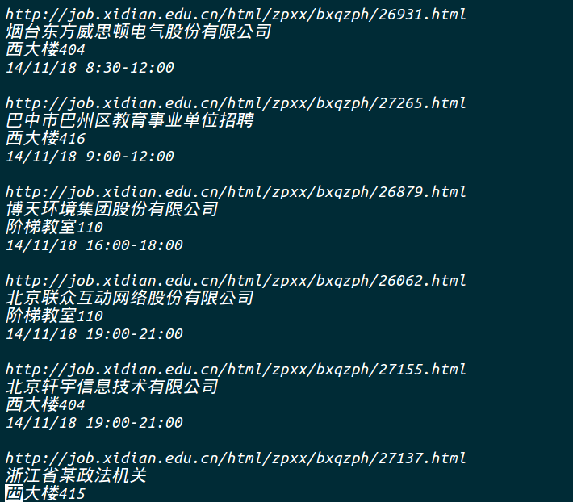

# spider
西电就业信息爬虫

&nbsp;&nbsp;&nbsp;程序爬取的是西电就业信息网的南、北校区的招聘信息，后面会把雁塔晨钟、西电睿思、好网论坛等就业板块的招聘信息的捉取加进来。

**注意：**可能由于您Python版本的不同和平台的不同（我在Linux下写的程序）而报错，程序使用了BeautifulSoup这个第三方模块。详细的内容也可查看[我的博客](http://blog.csdn.net/doubleselect/article/details/41220251)

效果图如下

